<!--
  Three-asset composition inspired by AVIVASHISHTA29/AVIVASHISHTA29.
  The generators and IBM visual system in this repository are independently implemented.
  Portrait: python scripts/prep_photo.py && python scripts/make_ascii_svg.py
  Info card: python scripts/make_info_card.py
-->

<h3><code>mertefe@sysplex ~ $ ./contributions.sh</code></h3>

 
 

<h3><code>mertefe@sysplex ~ $ whoami</code></h3>

<table>
<tr>
<td valign="top"></td>
<td valign="top"></td>
</tr>
</table>

 
 

<h3><code>mertefe@sysplex ~ $ ./links.sh</code></h3>

<b>Systems Engineer · 2026 IBM Champion · Quantum Research · Open Hardware</b>

  <a href="https://mertefesensoy.dev">PORTFOLIO</a> ·
  <a href="https://github.com/mertefesensoy">GITHUB</a> ·
  <a href="https://www.linkedin.com/in/mert-efe-%C5%9Fensoy-7bbb56290/">LINKEDIN</a> ·
  <a href="https://medium.com/@mefe.sensoy">MEDIUM</a> ·
  <a href="https://www.credly.com/badges/b58586a6-8305-47a5-8bd6-6a7e7b1ce69e/public_url">IBM CREDENTIAL</a> ·
  <a href="mailto:sensoymertefe@gmail.com">EMAIL</a>

<!-- PROFILE_STATS:START -->

<strong>GITHUB.ACTIVITY / LAST 12 MONTHS</strong> · Total: 959 contributions · Current streak: 3 days · Longest streak: 12 days · Best day: 85 contributions on 2026-01-12 · Generated: 2026-07-24

<!-- PROFILE_STATS:END -->

<code>mertefe@sysplex ~ $ less profile.dossier</code>

 

### `01 / ACTIVE SYSTEMS`

| SYS | Project | Current work | Status |
|:---|:---|:---|:---|
| `OMI` | [The Open Memory Initiative](https://github.com/The-Open-Memory-Initiative-OMI/omi) | Open, reproducible DDR4 UDIMM reference design: power/PDN, command/clock, data-lane schematics, SPD tooling, and educational documentation. | `ACTIVE DEVELOPMENT` |
| `SCTD` | [SuperconducTED](https://github.com/SuperconducTED) | Transferable IBM Quantum noise models using interval type-2 TSK fuzzy inference and ensemble simulation in Qiskit Aer; targeting IEEE QCE 2026. | `ACTIVE RESEARCH` |
| `MŞHT` | [Müşahit](https://github.com/mertefesensoy/MUSAHIT) | Local-first OSINT briefing pipeline for Turkish news with multi-agent clustering, severity ranking, DuckDB, Ollama, and Piper TTS. | `OPERATIONAL` |
| `DRMR` | [crypto-dreamer](https://github.com/mertefesensoy/crypto-dreamer) | DreamerV3-style BTC/USDT world model with an iTransformer encoder, RSSM core, and IQN distributional critic. | `RESEARCH` |
| `ZBRG` | [Go↔z/OS Bridge](https://github.com/mertefesensoy/zbridge-asm-lab) | Go-to-mainframe interoperability through assembly, z/Architecture calling conventions, ABI boundaries, and endianness. | `LAB` |

> OMI welcomes contributors. Start with the [open issues](https://github.com/The-Open-Memory-Initiative-OMI/omi/issues), join an [architecture discussion](https://github.com/The-Open-Memory-Initiative-OMI/omi/discussions), and review [CONTRIBUTING.md](https://github.com/The-Open-Memory-Initiative-OMI/omi/blob/main/CONTRIBUTING.md).

### `02 / ROLE & RECOGNITION`

- **2026 IBM Champion** — recognized for advocacy and technical community work. [View credential →](https://www.credly.com/badges/b58586a6-8305-47a5-8bd6-6a7e7b1ce69e/public_url)
- **IBM Z Student Ambassador** and **President of the IBM-Z Club at TED University** — connecting enterprise computing practitioners with the next generation of systems engineers.
- **Junior Data Analyst (Part Time), Revenue Management at Turkish Airlines** — analytical decision support in aviation operations.
- **Computer Engineering at TED University** with a **Business Administration minor** — expected 2027.

### `03 / SELECTED BUILDS`

- [**Valentine Pomodoro**](https://github.com/mertefesensoy/valentine-pomodoro) — React Native timer with drift-resistant timestamp logic, background notifications, offline persistence, and zero data collection.
- [**FreeRTOS Demo**](https://github.com/mertefesensoy/FreeRTOS_Demo) — concurrent tasks, mutex-protected buffers, deferred ISR processing, and FreeRTOS+UDP networking.
- [**BeeLink CN**](https://mertefesensoy.dev/en/case-studies/beelink-cn/) — concept-stage 5G health platform for remote monitoring, triage support, emergency routing, and hospital capacity awareness.
- [**Biotama**](https://biotamaglobal.com) — production B2B manufacturing site with Next.js, internationalized routing, rate limiting, and transactional email.

### `04 / TOOLCHAIN`

**Core:** `Java` `C` `TypeScript` `JavaScript` `Python` `SQL`

**Systems & research:** `C++` `C#` `Go` `Rust` `COBOL` `FreeRTOS` `Qiskit` `PyTorch` `FastAPI` `KiCad`

**Interfaces & data:** `React` `Next.js` `Tailwind CSS` `React Native` `Expo` `PostgreSQL` `DuckDB` `NumPy / Pandas`

**Platforms:** `GitHub Actions` `Docker` `IBM Z` `Linux` `Ollama` `Vercel`

### `05 / OPERATING PRINCIPLES`

- **Documentation First** — record architecture decisions before implementation.
- **Correctness Over Speed** — especially in embedded and hardware-adjacent systems.
- **Open-Source Toolchains** — reproducible environments and inspectable workflows.

---

Self-contained SVG artwork. Public contribution data is regenerated daily from GitHub without a personal access token or hosted stats service. Motion plays once and respects reduced-motion preferences. Composition inspired by <a href="https://github.com/AVIVASHISHTA29/AVIVASHISHTA29">Avi Vashishta's profile</a>; implementation is original.
